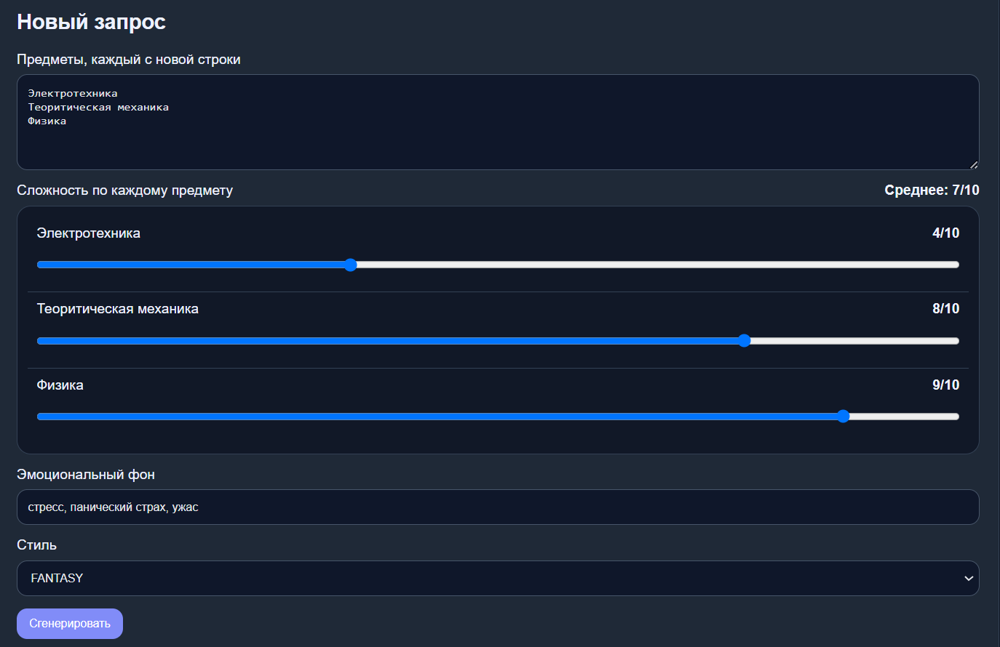
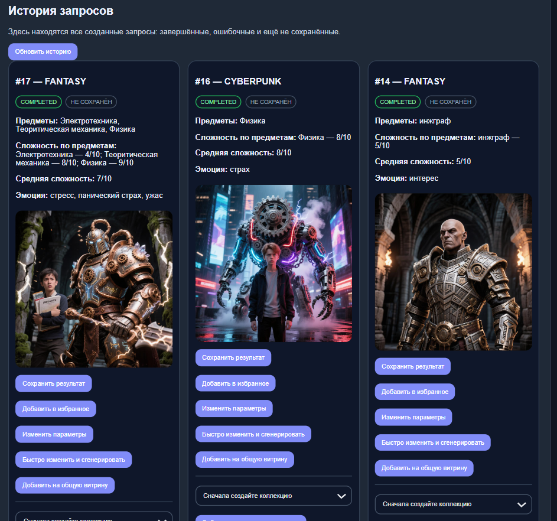
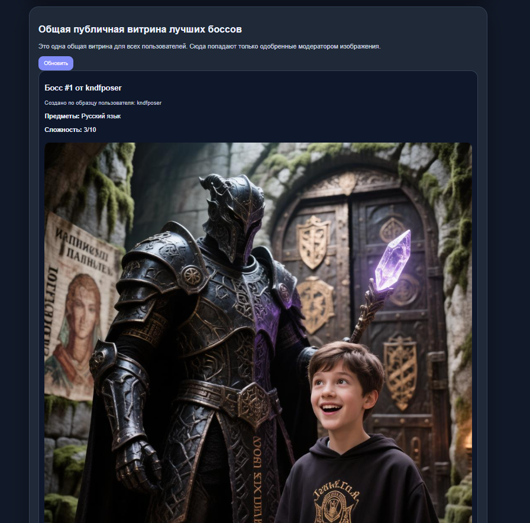

# Веб-сервис «Босс семестра»

Курсовой проект на Java/Spring Boot: backend + frontend + PostgreSQL + Swagger + интеграция с GigaChat.

---

##  О проекте

**«Босс семестра»** — это веб-приложение, которое позволяет студенту визуализировать учебную нагрузку в виде **«финального босса»** — объединённого образа всех предметов семестра.

Пользователь вводит список предметов, их сложность, эмоциональный фон и выбирает стиль, а система автоматически формирует промпт и через **GigaChat API** генерирует уникальное изображение.

---

##  Основной функционал

###  Пользователи
- **Регистрация и вход** — создание аккаунта с хэшированием пароля (SHA-256).
- **Роли** — `USER` (обычный пользователь) и `ADMIN` (модератор).

###  Генерация босса
- Ввод списка предметов (по одному на строку).
- Указание сложности **каждого предмета** (ползунок 1–10).
- Выбор **эмоционального фона** (например: «стресс», «надежда», «усталость»).
- Выбор **стиля визуализации**:
    - `FANTASY` — эпическое фэнтези
    - `CYBERPUNK` — неон, техно-образы
    - `COMIC` — яркий комикс
    - `ABSTRACT_ART` — абстрактная геометрия
- Один запрос → **одно изображение**.
- Промпт собирается **автоматически** — пользователь не пишет его вручную.

###  История и управление
- **История** — все созданные запросы (успешные и ошибочные).
- **Сохранённые** — отдельный список важных результатов.
- **Избранное** — персональная подборка понравившихся образов.
- **Клонирование** — создание нового запроса на основе старого с изменением параметров.

###  Коллекции боссов (доп. функция)
- Создание **коллекций** по семестрам (например: «Весна 2025»).
- Добавление боссов в коллекцию.
- Визуализация **эволюции сложности** — картинки и сложности отсортированы по дате создания.

###  Публичная витрина (доп. функция)
- Пользователь может **отправить своего босса на витрину**.
- **Модерация администратором** — одобрение или отклонение.
- **Общая витрина** — все пользователи видят только одобренные работы.
- Администратор видит список ожидающих модерации и может оставить комментарий.

### Ограничение генераций (доп. функция)
- Дневной лимит на количество генераций для одного пользователя (по умолчанию **5**).
- При превышении — ошибка `429 Too Many Requests`.
- Лимит можно настроить через `application.properties`.

### Статусы запроса
Каждый запрос проходит через статусы:
PENDING → RUNNING → COMPLETED (успех)
 ERROR (ошибка)

---

##  Архитектура и паттерны

| Паттерн | Где используется | Зачем |
|---------|------------------|-------|
| **Builder + Director** | `PromptDirector`, `SemesterBossPromptBuilder` | Пошаговая сборка промпта |
| **Strategy** | `StyleStrategy` и реализации (4 стиля) | Разные стили без if/else |
| **Chain of Responsibility** | Валидаторы (`SubjectsValidator`, `DifficultyValidator`, `ForbiddenContentValidator`) | Проверка входных данных |
| **Adapter** | `GigaChatImageGeneratorAdapter` | Адаптация GigaChat API к внутреннему интерфейсу |
| **Proxy** | `RateLimitedImageGeneratorProxy` | Контроль дневного лимита |
| **Facade** | `BossSemesterFacade` | Упрощённый API для контроллеров |
| **State** | `PendingState`, `RunningState`, `CompletedState`, `ErrorState` | Управление статусами запроса |
| **Observer** | `RequestEventPublisher`, `ApiLogSubscriber` | Логирование вызовов GigaChat |
| **Command** | `CreateBossGenerationCommand` | Инкапсуляция генерации как команды |
| **Memento** | `RequestMemento`, `RequestOriginator` | Сохранение состояния для клонирования |

---
##  Тест-кейсы

### ТК-1: Регистрация и вход пользователя

| Параметр | Значение |
|----------|----------|
| **Предусловия** | Приложение запущено, база данных подключена |
| **Шаги** | 1. Открыть `http://localhost:8080` 2. Ввести логин `testuser` и пароль `1234` 3. Нажать «Регистрация» 4. Нажать «Войти» с теми же данными |
| **Ожидаемый результат** | Появляется сообщение «Вы вошли как testuser», доступны все разделы |

### ТК-2: Создание босса (демо-режим)

| Параметр | Значение |
|----------|----------|
| **Предусловия** | Пользователь авторизован, ключ GigaChat не задан (или введён DEMO) |
| **Шаги** | 1. В разделе «Генерация» ввести предметы (по одному на строку) 2. Установить сложности ползунками 3. Выбрать стиль «FANTASY» 4. Нажать «Сгенерировать» |
| **Ожидаемый результат** | Появляется изображение с надписью «DEMO MODE: подключите GIGACHAT_AUTH_KEY» |

### ТК-3: Сохранение и избранное

| Параметр | Значение |
|----------|----------|
| **Предусловия** | Есть хотя бы один созданный босс |
| **Шаги** | 1. В истории найти босса 2. Нажать «Сохранить результат» 3. Нажать «Добавить в избранное» 4. Перейти в раздел «Сохранённые» 5. Перейти в раздел «Избранное» |
| **Ожидаемый результат** | Босс отображается и в «Сохранённых», и в «Избранном» |

### ТК-4: Создание коллекции и добавление босса

| Параметр | Значение |
|----------|----------|
| **Предусловия** | Пользователь авторизован, есть сохранённый босс |
| **Шаги** | 1. Перейти в раздел «Коллекции» 2. Нажать «Создать коллекцию», ввести название «Тестовая коллекция» 3. В истории нажать «Добавить в коллекцию» и выбрать созданную коллекцию |
| **Ожидаемый результат** | В коллекции отображается добавленный босс |

### ТК-5: Модерация витрины (администратор)

| Параметр | Значение |
|----------|----------|
| **Предусловия** | Пользователь отправил босса на витрину |
| **Шаги** | 1. Выйти из пользователя 2. Войти как admin/admin123 3. Перейти в раздел «Модерация» 4. Нажать «Одобрить» у любой заявки |
| **Ожидаемый результат** | Босс появляется в разделе «Общая витрина» |

---

## Скриншоты работы

### Экран 1: Форма генерации

### Экран 2: История запросов

### Экран 3: Публичная витрина

---

##  Запуск проекта

### Требования
- JDK 21
- Maven 3.8+
- PostgreSQL 14+ (создайте базу `boss_semester`)

